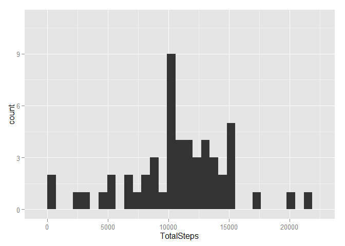
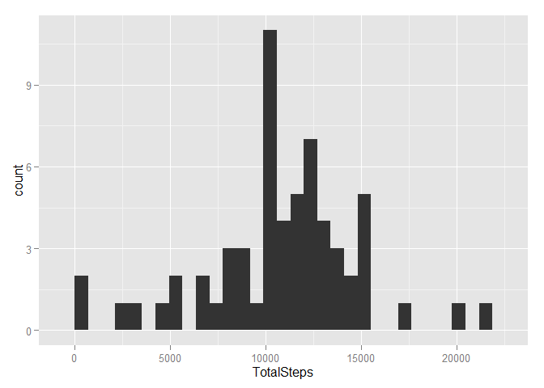
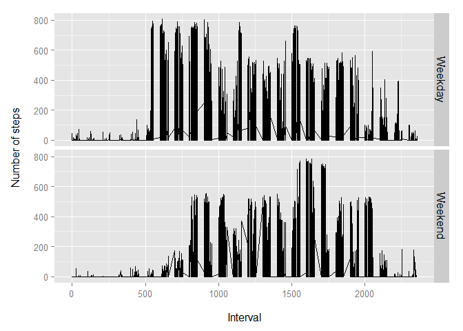

# Reproducible Research: Peer Assessment 1


## Loading and preprocessing the data

1. Load the data:


```r
unzip('activity.zip')
activity <- read.csv('activity.csv')
```

2. Process the data:


```r
library(dplyr)
library(lubridate)

activity <- mutate(activity, 
                   DayOfTheWeek = wday(ymd(date)))
```

## What is mean total number of steps taken per day?

1. Calculate the total number of steps taken per day: 


```r
library(ggplot2)

activityByDate <- group_by(activity,date)

totalDailySteps <- summarise(activityByDate,
                             TotalSteps = sum(steps))
```

2. Make a histogram of the total number of steps taken each day:


```r
stepsHist <- ggplot(totalDailySteps,
                    aes(x = TotalSteps))

stepsHist + 
    geom_histogram() + 
    scale_y_continuous(
        limits = c(0, 11))
```

 

3. Calculate and report the mean and median of the total number of steps taken per day:


```r
totalDailyStepsMean <- mean(totalDailySteps$TotalSteps,
                            na.rm = T)

totalDailyStepsMedian <- median(totalDailySteps$TotalSteps,
                                na.rm = T)
```

The mean of the total number of steps taken per day is 10766.19 and the median is 10765.

## What is the average daily activity pattern?

1. Make a time series plot of the 5-minute interval and the average number of steps taken, averaged across all days:


```r
activityByInterval <- group_by(activity,
                               interval)

fiveMinInterval <- summarise(activityByInterval,
                             AverageSteps = mean(steps,
                                                 na.rm = T))

intervalLine <- ggplot(fiveMinInterval,
                       aes(x = interval,
                           y = AverageSteps))

intervalLine + 
    geom_line()
```

 

2. Which 5-minute interval, on average across all the days in the dataset, contains the maximum number of steps?


```r
intervalAvgSteps <- fiveMinInterval$AverageSteps

maxStepsIndex <- which.max(intervalAvgSteps)

maxStepsInterval <- fiveMinInterval[maxStepsIndex, 1]
maxStepsInterval <- as.numeric(maxStepsInterval)
```

Interval 835 contains the maximum number of steps.

## Imputing missing values

1. Calculate and report the total number of missing values in the dataset:


```r
stepsNAs <- is.na(activity$steps)

stepsNACount <- length(stepsNAs[stepsNAs == T])
```

There are 2304 missing values in the dataset.

2. Devise a strategy for filling in all of the missing values in the dataset:

* Determine the indices of the missing values
* Determine the average steps for each interval by day of the week
* Loop through the 2304 missing values
* Replace the missing values with the average steps whose intervals and weekdays match those of the missing values

3. Create a new dataset that is equal to the original dataset but with the missing data filled in:


```r
stepsNAIndices <- which(stepsNAs)

activityByIntervalAndWday <- group_by(activity,
                                      interval,
                                      DayOfTheWeek)

intervalAvgByWday <- summarise(activityByIntervalAndWday,
                               AverageSteps = mean(steps,
                                                   na.rm = T))

intervals <- intervalAvgByWday$interval
weekDay <- intervalAvgByWday$DayOfTheWeek
averageSteps <- intervalAvgByWday$AverageSteps

imputedActivity <- activity

for (i in stepsNAIndices) {
    imputedActivity$steps[i] = averageSteps[intervals == activity$interval[i] & 
                                            weekDay == activity$DayOfTheWeek[i]]
}
```

4. Make a histogram of the total number of steps taken each day and calculate and report the mean and median total number of steps taken per day:


```r
imputedActivityByDate <- group_by(imputedActivity,
                                  date)

totalDailyStepsImputed <- summarise(imputedActivityByDate,
                                    TotalSteps = sum(steps))

stepsHistImputed <- ggplot(totalDailyStepsImputed,
                           aes(x = TotalSteps))

stepsHistImputed + 
    geom_histogram() + 
    scale_y_continuous(limits = c(0, 11))
```

 

```r
totalDailyStepsImputedMean <- mean(totalDailyStepsImputed$TotalSteps)
totalDailyStepsImputedMedian <- median(totalDailyStepsImputed$TotalSteps)
```

The mean of the total number of steps taken per day with imputed data in place of missing values is 10821.21 and the median is 11015. The mean differs by 55.02 and the median differs by 250 from the estimates from the first part of the assignment. The effect of imputing the missing data on the estimates of the total daily number of steps is to raise its average without affecting the tails of the histogram.

## Are there differences in activity patterns between weekdays and weekends?

1. Create a new factor variable in the dataset with two levels -- "weekday" and "weekend" indicating whether a given date is a weekday or weekend day:


```r
imputedActivity <- mutate(imputedActivity,
                          DayType = ifelse(DayOfTheWeek %in% c(1,7),
                                           'Weekend',
                                           'Weekday'))
```

2. Make a panel plot containing a time series plot of the 5-minute interval (x-axis) and the average number of steps taken, averaged across all weekday days or weekend days (y-axis):


```r
stepsLine <- ggplot(imputedActivity,
                    aes(x = interval,
                        y = steps))

stepsLine +
    geom_line() +
    xlab('\nInterval') +
    ylab('Number of steps\n') +
    facet_grid(DayType ~ .) +
    theme(text = element_text(size = 12),
          strip.text = element_text(size = 12))
```

 

There are fewer steps taken during the weekends than during the weekdays. The activity tends to be distributed over a smaller number of intervals on the weekends.
